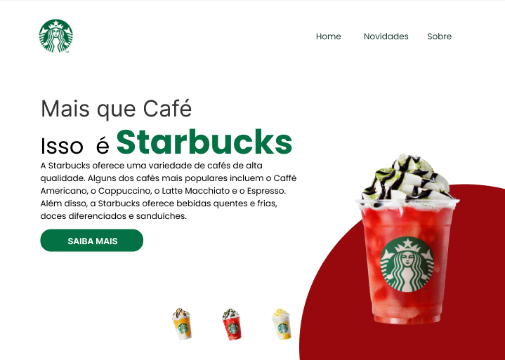

# Projeto de Front-End (React): Starbucks ☕

## 📜 Descrição

Bem-vindo ao Starbucks Clone! Este é um projeto inspirado na página oficial da Starbucks, criado durante o curso de Front-end do VnW. O objetivo é recriar a experiência visual do site da Starbucks utilizando React. O resultado? Uma página vibrante, moderna e totalmente responsiva, que te transporta para o universo da Starbucks com apenas alguns cliques.

## 🎨 Layout Fornecido

O layout do projeto foi fornecido no Figma como base para a construção do site. O design foi cuidadosamente planejado para refletir a identidade visual da Starbucks, garantindo uma experiência consistente e básica.

Este design serviu como base para a construção do site e devia ser seguido para garantir que o resultado final esteja alinhado com as especificações visuais e funcionais fornecidas no curso.

## 🛠️ Tecnologias Utilizadas

Neste projeto, utilizei um conjunto poderoso de ferramentas e bibliotecas para criar uma experiência interativa e responsiva. Confira abaixo as principais tecnologias empregadas:

**React:** A biblioteca JavaScript mais popular para construir interfaces de usuário interativas e dinâmicas. Com React, criamos componentes reutilizáveis que tornam o desenvolvimento mais eficiente e a manutenção do código mais fácil.

**React Router:** Utilizado para navegar entre páginas sem recarregar a página inteira, proporcionando uma experiência fluida e contínua. Isso torna o site uma Single Page Application (SPA), onde as mudanças de conteúdo acontecem de forma rápida e sem interrupções.

**React Hooks:** Utilizei os React Hooks, como o useState e o useEffect, para gerenciar o estado da aplicação e executar efeitos colaterais de forma eficiente. Esses hooks permitem um controle mais direto e organizado do estado da interface, além de tornar o código mais limpo e fácil de entender.

**Styled-components:** Uma poderosa biblioteca que permite escrever CSS-in-JS. Com o Styled-components, a estilização dos componentes é feita diretamente no JavaScript, o que facilita a criação de estilos encapsulados e reutilizáveis. Isso também permite uma melhor organização do código e uma maior flexibilidade no controle de estilos, tornando o projeto ainda mais modular.

**Responsividade:** A aplicação foi desenvolvida com um design responsivo, garantindo que o site se adapte perfeitamente a diferentes dispositivos e tamanhos de tela, como desktops, tablets e smartphones. O layout é dinâmico, garantindo que a experiência do usuário seja consistente em qualquer plataforma.

## 📝 Licença

Este projeto está licenciado sob a MIT License.
